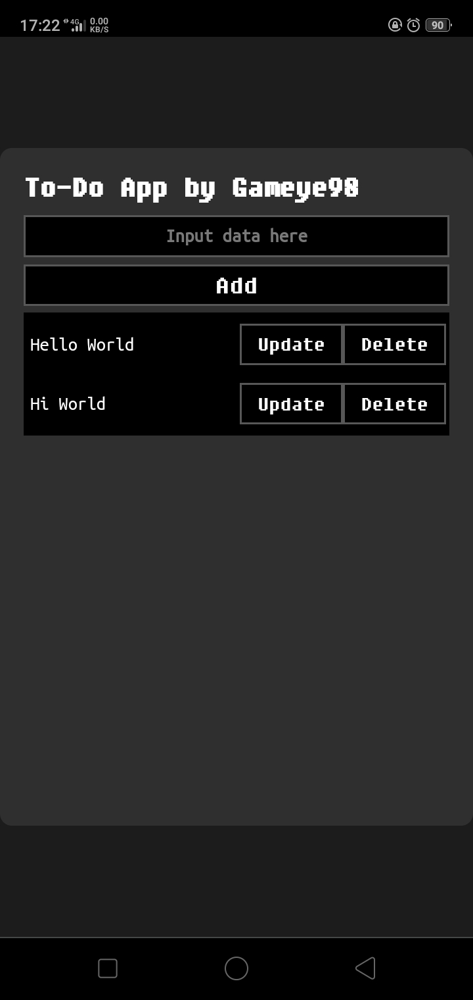
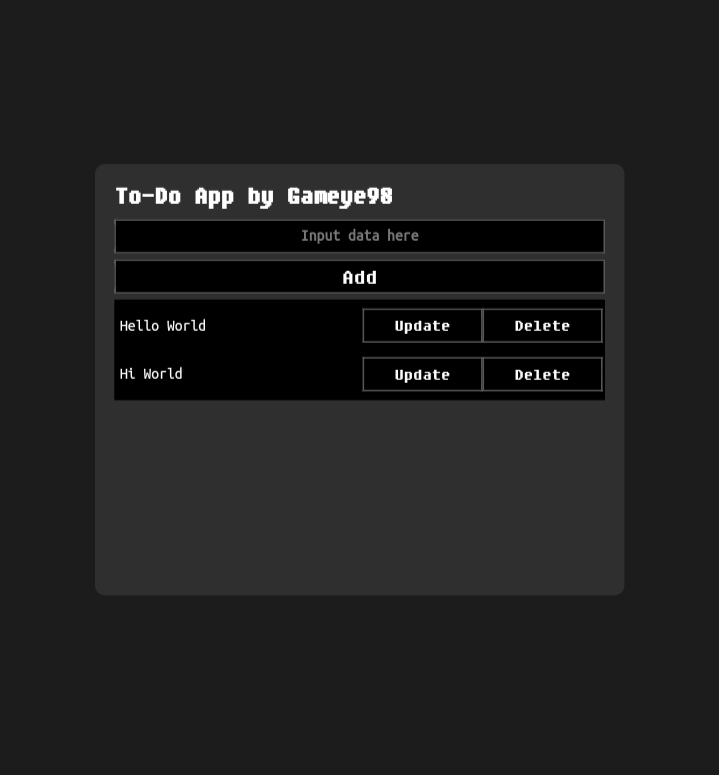

[](https://github.com/Gameye98/to-do/stargazers)
[](https://github.com/Gameye98/to-do/network/members)
[](https://github.com/Gameye98/to-do/issues)
[](https://github.com/Gameye98/to-do/watchers)
[](https://html.com)
[](https://www.w3.org/Style/CSS/Overview.en.html)
[](https://www.javascript.com)
[](https://www.php.net)
[](http://www.wtfpl.net/)
[](https://github.com/BlackHoleSecurity)
[](https://github.com/Gameye98)

[](https://github.com/Gameye98)  

# To-Do App
Simple To-Do App using HTML/CSS/JS & PHP as the Backend for handling any modification to DB.

### Hardcoded host
There are hardcoded host on js/script.js  
```http://localhost:8080```  
which then u can replace by manually editing the file and replace the host.

### Testing
```bash
$ apt update && apt upgrade -y
$ apt install php
$ php -S localhost:8080
```

### Screenshot
On Android:  
  
On Desktop:  
  
